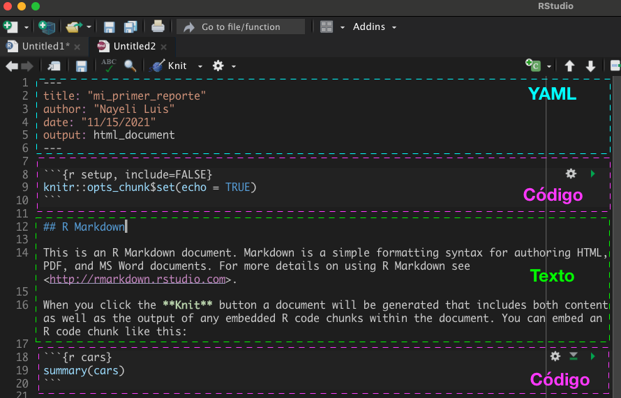

---
output:
  pdf_document: default
  html_document: default
---

# Reportes con `R Markdown`

Para generar un reporte se debe dar clik en `File` > `New File` > `R Markdown`. Se abrirá una plantilla que muestra la estructura básica de un documento `.Rmd`: Sección de metadatos escrita en `YAML`, bloques o *chunks* de código y texto escrito con etiquetas.

```{r , out.width="80%", out.height="80%", fig.align='center'}

```

## Texto con etiquetas

### Encabezados

Los encabezados hacen referencia a los títulos y subtítulos que se pueden colocar, existen seis niveles para denotar encabezados. La etiqueta para los encabezados es el símbolo de numeral (#) + espacio.

```{r, eval = FALSE}
# Encabezado primer nivel
## Encabezado segundo nivel
### Encabezado tercer nivel
#### Encabezado cuarto nivel
##### Encabezado quinto nivel
###### Encabezado sexto nivel
```


### Énfasis en texto 

Hace referencia a las negritas e italicas o cursivas. Las etiquetas para hacer énfasis son los asteriscos (*) y los guiones bajos (_).

**Texto y etiquetas en el archivo `.Rmd`:**

```{r eval = FALSE}
*Esto está en cursiva*
  
_Esto también_

**Esto está en negritas**
  
__Esto también__

***Esto está en negritas y cursivas***
```

**Texto en archivo compilado**:

*Esto está en cursiva*

_Esto también_

**Esto está en negritas**

__Esto también__

***Esto está en negritas y cursivas***

### Subíndices y superíndices

La etiqueta para los subíndices es la virgulilla (~), mientras que para los superíndices el símbolo de circunflejo (^).

**Texto y etiquetas en el archivo `.Rmd`:**

```{r, eval = FALSE}
Subíndice: CO~2~
  
Superíndice: Mg^2+^
```

**Texto en archivo compilado**:

Subíndice: CO~2~

Superíndice: Mg^2+^

### Espacios entre párrafos

Para dejar espacios entre párrafos se debe dejar una línea en blanco en el archivo `.Rmd`. 


**Texto y etiquetas en el archivo `.Rmd`:**

```{r, eval = FALSE}
__Párrafo 1.__
"Mientras he estado en esta parte alta casi no he comido otra cosa que carne de tortuga. El pecho, asado al estilo de los gauchos, es decir, sin quitarle la piel, es excelente; con las tortugas jóvenes se hace muy buena sopa."

__Párrafo 2.__
“El hombre selecciona solo por su propio bien: la naturaleza solo por la del ser que ella tiende”.
```

**Texto en archivo compilado:**

__Párrafo 1.__
"Mientras he estado en esta parte alta casi no he comido otra cosa que carne de tortuga. El pecho, asado al estilo de los gauchos, es decir, sin quitarle la piel, es excelente; con las tortugas jóvenes se hace muy buena sopa."

__Párrafo 2.__
“El hombre selecciona solo por su propio bien: la naturaleza solo por la del ser que ella tiende”.


### Listas


#### Listas ordenadas

**Texto y etiquetas en el archivo `.Rmd`:**

```{r, eval = FALSE}
1. Rojo
2. Azul
3. Verde
```


**Texto en archivo compilado:**

1. Rojo
2. Azul
3. Verde

#### Listas desordenadas

Las etiquetas para las listas desordenadas son los asterisocs (*) + espacio y los guiones (-) + espacio.


**Texto y etiquetas en el archivo `.Rmd`:**

```{r, eval = FALSE}
- Rojo
- Azul
* Verde
```

**Texto en archivo compilado:**

- Rojo
- Azul
* Verde


#### Listas anidadas

Para las listas anidadas, es necesario dar un `tab` para el siguiente nivel de lista que se desea.

**Texto y etiquetas en el archivo `.Rmd`:**

```{r, eval = FALSE}
- Rojo
  1. Borgoña
  2. Carmesí
- Verde
  1. Olivo
```

**Texto en archivo compilado:**
- Rojo
  1. Borgoña
  2. Carmesí
- Verde
  1. Olivo
  
### Hipervínculos

**Sintaxis**: 

Opción 1:
```{r, eval = FALSE}
[Texto](URL)
```

Opción 2: 

```{r, eval = FALSE}
<URL>
```


Ejemplo: 

**Texto y etiquetas en el archivo `.Rmd`:**

Opción 1:
```{r, eval = FALSE}
[Winter Genomics](https://www.wintergenomics.com/)
```

Opción 2: 
```{r, eval = FALSE}
<https://www.wintergenomics.com/>
```


**Texto en archivo compilado:**

* Opción 1:
Ésta es la página de [Winter Genomics](https://www.wintergenomics.com/)


* Opción 2: 
<https://www.wintergenomics.com/>

### Figuras

**Sintaxis**: 

```{r eval = FALSE}
{especificaciones}
```


**Ejemplo:** 

```{r, eval = FALSE}
{width=20% heigth=20%}
```

**Output**
{width=20% heigth=20%}


### Ecuaciones matemáticas

Para ingresar ecuaciones matemáticas se utiliza el signo de pesos ($) como etiqueta y [los símbolos matemáticos de LaTex] (https://www.caam.rice.edu/~heinken/latex/symbols.pdf). Además se tienen las siguientes opciones:


* Opción 1:


```{r, eval = FALSE}

$F = (C\frac{9}{5}+32)$ 
```


$F = (C\frac{9}{5}+32)$ 

* Opción 2:

```{r, eval = FALSE}
$$F = (C\frac{9}{5}+32)$$ 
```

$$F = (C\frac{9}{5}+32)$$ 

* Opción 3:

```{r, eval = FALSE}
$$
  \int_0^\infty \frac{x^3}{e^x-1}\,dx = \frac{\pi^4}{15}
$$
```


$$
  \int_0^\infty \frac{x^3}{e^x-1}\,dx = \frac{\pi^4}{15}
$$


### Comentarios

```{r, eval = FALSE}
<!-- Esto es un comentario en un archivo .Rmd -->
```


## Código en R Markdown

* Instalar paqueterías para gráficos y tablas: 


```{r, echo = TRUE, eval = FALSE}
paqueterias <- c("palmerpenguins", # Datos
                 "ggstatsplot", # Gráficos con detalles estadísticos
                 "kableExtra", # Tablas
                 "flextable", # Tablas
                 "tidyverse") # Para ciencia de datos
install.packages(paqueterias)
```

### Configuraciones de chunks


Los bloques de código también tienen sus opciones, ¿Deseamos que se muestre el resultado? ¿Sólo el resultado del código? ¿Ambos?

Algunos de éstas opciones son:

* `echo =`: ¿Queremos que nuestro reporte incluya nuestro código?
* `eval =`: ¿Queremos que R evalúe el código?
* `message =`: ¿Queremos que nuestro reporte incluya los mensajes de la consola?


**Importante**: Éstas configuraciones son de tipo booleana (`TRUE`, `FALSE`)

Vamos a ver a continuación los casos

* Primer caso 

Bloque de código en nuestro archivo `.Rmd`:
````markdown

`r ''````{r, echo = TRUE, eval=TRUE, message = TRUE}

library(tidyverse)

```

````

Lo que obtenemos en nuestro archivo compilado:

```{r, echo = TRUE, eval=TRUE, message = TRUE}
library(tidyverse)
```


* Segundo caso

Bloque de código en nuestro archivo `.Rmd`:

````markdown
`r ''````{r, echo = TRUE, eval=TRUE, message = FALSE}

library(tidyverse)

```
````

Lo que obtenemos en nuestro archivo compilado:

```{r, echo = TRUE, eval=TRUE, message = FALSE}
library(tidyverse)
```


* Tercer caso:
Bloque de código en nuestro archivo `.Rmd`:

````markdown

`r ''````{r, echo = FALSE, eval=TRUE, message = FALSE}

library(tidyverse)

```

````

Lo que obtenemos en nuestro archivo compilado:

Nada... Aquí solo se cargó la librería y listo.


### Insertar figuras con código:

Ahora veremos algunas de las opciones para insertar figuras y modificar el tamaño, la alineación y la inserción de títulos en las figuras.

Comandos para la modificación de tamaño:

* `out.width  = "45%"`

* `out.height  = "45%"`

* `fig.out = 4`

* `figt.width  = 4`

Comando para alinear: 

* `fig.align = "center"`

Comando para insertar títulos en las figuras:

* `fig.cap = "Título de la figura"`


Ejemplo:

Bloque de código en nuestro archivo `.Rmd`:

````markdown

`r ''````{r, echo = TRUE, eval=TRUE, out.width = '50%', fig.align = 'center', fig.cap = "Pingüinos"}
url1 <- 'https://www.goodnewsnetwork.org/wp-content/uploads/2014/11/penguin-science-rover-Le_Maho-research-in-NatureMethods.jpg'

knitr::include_graphics(url1) 
```

````

Lo que obtenemos en nuestro archivo compilado:


```{r, echo = TRUE, eval=TRUE, out.width = '50%', fig.align = 'center', fig.cap = "Pingüinos"}
url1 <- 'https://www.goodnewsnetwork.org/wp-content/uploads/2014/11/penguin-science-rover-Le_Maho-research-in-NatureMethods.jpg'

knitr::include_graphics(url1) 
```

### Insertar gráficos

Para éste apartado utilizaremos las librerias de [`palmerpenguins`](https://allisonhorst.github.io/palmerpenguins/), [`ggstatsplot`](https://indrajeetpatil.github.io/ggstatsplot/) y [](https://www.tidyverse.org/)

* Primero, vamos a cargar las paqueterías en cuestión: 
```{r eval=TRUE, echo=TRUE, message=FALSE}
library(palmerpenguins)
library(ggstatsplot)
```

* Para conocer los datos puedes escribir en un script de apoyo el siguiente comando:
```{r , message = TRUE}
data(package = 'palmerpenguins')
```

Imprimirá por consola lo siguiente: 
```{r, eval = FALSE}
Data sets in package ‘palmerpenguins’:

penguins                    Size measurements for adult foraging penguins near
                            Palmer Station, Antarctica
penguins_raw (penguins)     Penguin size, clutch, and blood isotope data for
                            foraging adults near Palmer Station, Antarctica
```

Esto quiere decir que nuestra libreria contiene dos datasets `penguins` y `penguins_raw`.


* Procesamos a generar un gráfico, para esto utilizaremos las configuraciones de `fig.width = ` y `fig.height=`. 

Bloque de código en nuestro archivo `.Rmd`:
````markdown

`r ''````{r, echo = TRUE, warning = FALSE, fig.width = 7, fig.height = 8, fig.align = 'center'}

plt <- ggbetweenstats(
  data = penguins,
  x = species,
  y = flipper_length_mm
)  + 
  labs(
    x = "Especies",
    y = "Longitud del pico",
    title = "Distribución de la longitud del pico."
  ) + 
  theme(
    text = element_text(size = 9, 
                        color = "black"),
    plot.title = element_text(
      size = 20,
      face = "bold",
      color = "#2a475e"
    )
    )

plt
```
````

Lo que obtenemos en nuestro archivo compilado:
```{r, echo = TRUE, warning = FALSE, fig.width = 7, fig.height = 8, fig.align = 'center'}

plt <- ggbetweenstats(
  data = penguins,
  x = species,
  y = flipper_length_mm
)  + 
  labs(
    x = "Especies",
    y = "Longitud del pico",
    title = "Distribución de la longitud del pico."
  ) + 
  theme(
    text = element_text(size = 9, 
                        color = "black"),
    plot.title = element_text(
      size = 20,
      face = "bold",
      color = "#2a475e"
    )
    )

plt
```


Para conocer más opciones sobre la configuración de los bloques de código, puedes consultar el libro [knitr: elegant, flexible, and fast dynamic report generation with R](https://yihui.org/knitr/options/).

### Tablas con paqueterías especializadas

Utilizaremos las librerias de [`kableExtra`](https://cran.r-project.org/web/packages/kableExtra/vignettes/awesome_table_in_html.html) y [`flextable`](https://ardata-fr.github.io/flextable-book/). 

* Primero, llamamos a las librerías: 
```{r, echo = TRUE, eval = TRUE}
library(kableExtra)
library(flextable)
library(tidyverse)
```

* Luego, vamos a generar una tabla sencilla con `kable`, ésta paquetería viene incluida en `knitr`. Además utilizaremos la tabla de `penguins` incluida en la librería de `palmerpenguins`. 

```{r, echo = TRUE}
# Filtrado rápido
penguins_table <- head(penguins, 10)[,1:4]

tabla1 <- knitr::kable(penguins_table, 
  caption= "Tabla con kable")

tabla1
```


#### Tabla con `kableExtra`

Ahora, reharemos nuestra tabla anterior pero adicionaremos algunas especificaciones en las filas (`row_spec`) y en las columnas (`column_spec`) con `kableExtra`. 

```{r, echo=TRUE, warning=FALSE, message = FALSE}

tabla2 <- knitr::kable(penguins_table, 
  caption= "Tabla con kableExtra") %>% 
  row_spec(1, bold = TRUE, italic = TRUE) %>% 
  row_spec(2:3, color = 'white', background = 'black') %>%
  row_spec(4, underline = TRUE, monospace = TRUE) %>%
  column_spec(4, strikeout = TRUE)

tabla2

```

Aquí podemos observar un símbolo nuevo (%>%), éste símbolo es conocido como *pipe* y pertenece a la librería de `magrittr`, la cual a su vez viene incluida en `tidyverse`. Un *pipe* permite conectar procesos, tomando el resultado de salida del proceso anterior como entrada del siguiente proceso. Ésta acción permite que el código sea mucho más limpio y fácil de leer y que el programa sea más eficiente.


#### Tabla con [`Flextable`](https://ardata-fr.github.io/flextable-book/)

Para la generación de la tabla con ésta paquetería utilizaremos el dataset de `penguins_raw` de nuestra libreria de `palmerpenguins`. 

```{r, echo = TRUE, eval = TRUE, message = FALSE}

# Filtrado rápido
penguins_data3 <- head(penguins_raw, n = 5)[, c(3,10:14)]

penguins_data3 %>%
  flextable()%>%
  fix_border_issues(part="all")%>%
  bold(part="header") %>%
  align(align = "center", part= "all") %>%
  color(., ~ `Culmen Length (mm)`  < 40, ~ `Culmen Length (mm)` , color = "orange") %>% 
  color(., ~ `Culmen Depth (mm)` > 18, ~ `Culmen Depth (mm)`, color = "green") %>%
  bg(.,bg = "#AEDEF3", part = "header")
  
```

Como se puede observar, con `flextable` también es posible llevar a cabo diversas modificaciones que permiten una mejor visualización de las tablas que reportemos. 

## Sección de metadatos: YAML

`YAML` *Ain`t Markup Language* (YAML no es un lenguaje de marcado). Es un lenguaje que permite especificar algunos detalles del documento de salida como: el autor, el título, la fecha, si deseamos que las secciones estén numeradas, la tabla de contendio,  entre muchas otras cosas.

Por ejemplo: 

````yaml
---
title: "Mi primer reporte"
author: "Winter Genomics"
date: "26/11/2021"
output: html_document
---
````

Para agregar tablas de contenido podemos utilizar `toc` que significa *Table of Contents`. 

````yaml
---
title: "Mi primer reporte"
author: "Winter Genomics"
date: "26/11/2021"
output: 
  html_document:
    toc: true # Agrega la tabla de contenido
    toc_float: true # Agrega un índice "flotante"
---
````

También se puede agregar el número de secciones con el comando `number_sections`:

````yaml
---
title: "Mi primer reporte"
author: "Winter Genomics"
date: "26/11/2021"
output: 
  html_document:
    toc: true
    toc_float: true
    toc_depth: 1
    number_sections: true
    theme: "yeti"
    highlight: "tango"
---
````

Y, por útimo, `R Markdown` nos da la opción de cambiar el tema y el resaltado con los comandos `theme: ` y `highlight: `. 

````yaml
---
title: "Mi primer reporte"
author: "Winter Genomics"
date: "26/11/2021"
output: 
  html_document:
    toc: true
    toc_float: true
    number_sections: true
    theme: "yeti"
    highlight: "tango"
---
````

Si deseas conocer todas las opciones de temas que `R Markdown` tiene disponible puedes escribir en consola o en un script de apoyo lo siguiente:

```{r  echo = TRUE}
rmarkdown:::themes()
```

También podemos conocer las opciones de resaltado con:


```{r, echo = TRUE}
rmarkdown:::highlighters()
```


Por otro lado, [ésta página](https://cran.r-project.org/web/packages/ymlthis/vignettes/yaml-fieldguide.html) contiene todos los argumentos que se pueden especificar en la sección de metadatos con `YAML`. 

