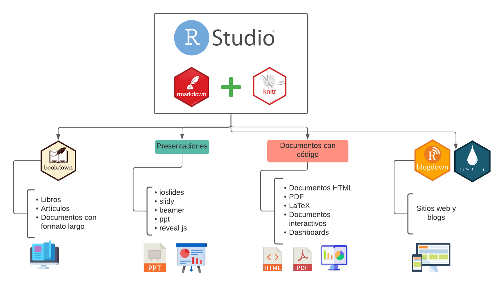

---
output:
  pdf_document: default
  html_document: default
---

# Introducción a la documentación

## ¿Por qué documentar?

La documentación de código es un proceso importante para conservar la reproducibilidad de nuestros experimentos bioinformáticos. Al documentar código de manera correcta logramos dar mayor fiabilidad a nuestros resultados. Sin mencionar que es una buena práctica, pues también nos ayuda a comprender los proyectos que alguna vez debemos retomar en el futuro. 

La documentación de código se lleva a cabo con un lenguaje de marcado como `Markdown`. 

## `Markdown`

`Markdown` es un lenguaje de marcado ligero que facilita la aplicación de formato a un texto, empleando una serie de caracteres especiales. Un lenguaje de marcado se encarga de colocar etiquetas a un texto a través de caracteres como numerlaes (#), guiones (-), acentos graves (`), etc. 


```r
knitr::include_graphics("img/markdown-sintaxis.png")
```


\begin{center}\includegraphics[width=0.8\linewidth,height=0.8\textheight]{img/markdown-sintaxis} \end{center}

### Ventajas de aprender `Markdown`

* Escribir es más rápido y cómodo. Dar formato a un txto largo es más simple porque se tiene más orden. 
* Es fácil de leer, ya que solo hay texto y etiquetas (denotadas por caracteres especiales).
* Un archivo `.md` es un archivo de texto plato, lo que lo hace compatible con cualquier SO y ligero.
* Todo es completamente gratuito. 

## `R Markdown`

`R Markdown` es un programa incluido en `R Studio` que permite generar informes con texto, segmento de código y gráficas, utilizando todas las paqueterías que `R` brinda a sus usuarios. 


```r
knitr::include_graphics("img/rmd.png")
```


\begin{center}\includegraphics[width=0.8\linewidth,height=0.8\textheight]{img/rmd} \end{center}

Con `R Markdown` se pueden crear todo tipo de documentos como libros, presentaciones, archivos en HTML e incluso blogs y sitios web.


```r

```


\begin{center}\includegraphics[width=0.8\linewidth,height=0.8\textheight]{img/rmd_knitr} \end{center}

### ¿Cómo funciona?

Una vez generado un archivo `.Rmd` con código, gráficas y texto, interviene una paquetería llamada `knitr` la cual se encarga de "tejer" o compilar nuestro documento. `knitr` convierte el archivo `.Rmd` en un archivo `.md` para posteriormente ser procesado por `pandoc`, un convertidor de documentos universal, que transforma el archivo `.md` en lo el documento que queramos.


```r
knitr::include_graphics("img/como_funciona.png")
```


\begin{center}\includegraphics[width=0.8\linewidth,height=0.8\textheight]{img/como_funciona} \end{center}

### Para saber más...

Para saber más sobre `R Markdown` se pueden consultar los siguientes recursos:

* La [CheatSheet R Markdown](https://www.rstudio.com/wp-content/uploads/2015/02/rmarkdown-cheatsheet.pdf)
* El libro: [R Markdown: The definitive Guide](https://bookdown.org/yihui/rmarkdown/)
* El libro: [R Markdown Cookbook](https://bookdown.org/yihui/rmarkdown-cookbook/)
